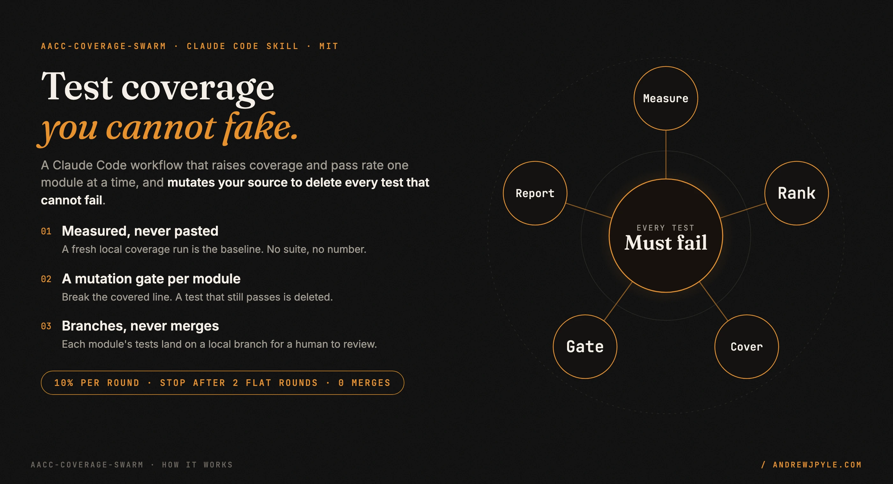
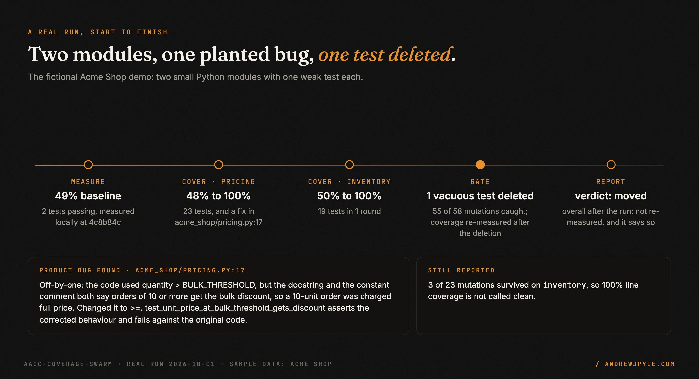
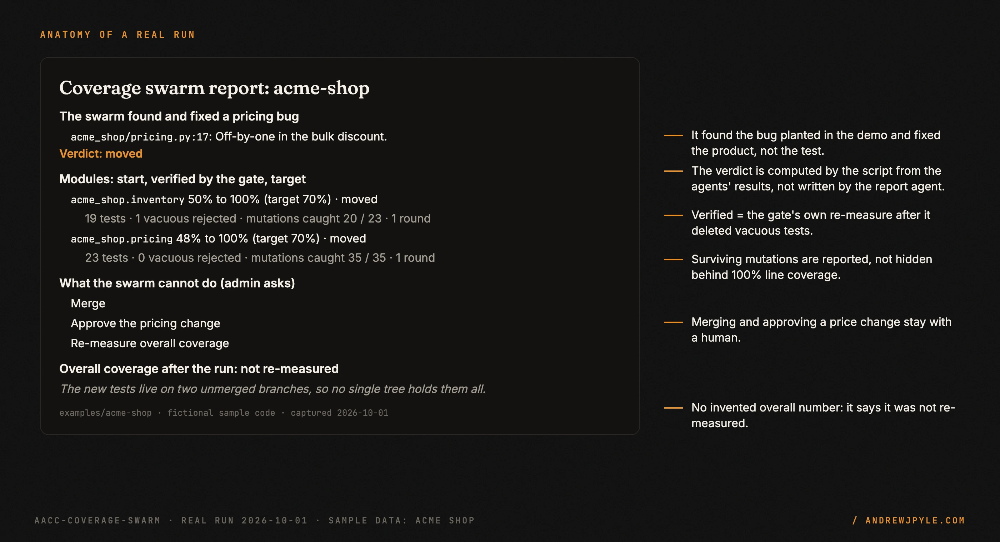
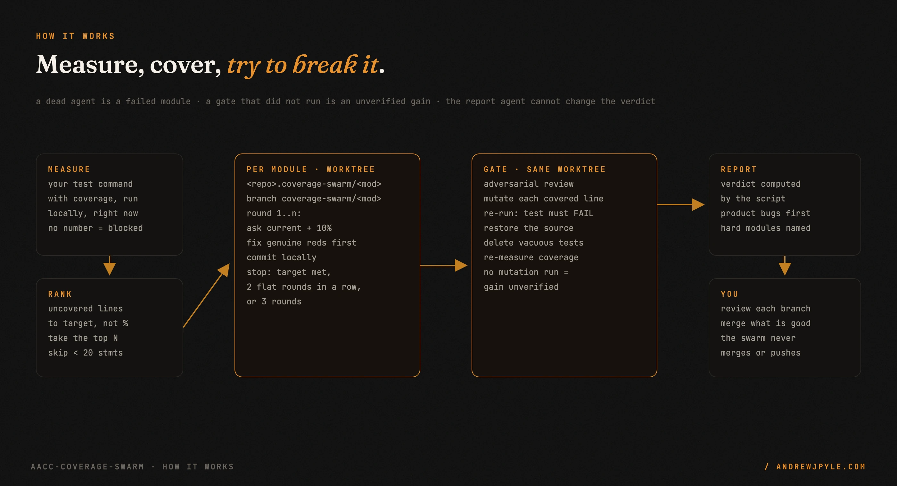

<p align="center">
  
</p>

<p align="center">
  <a href="https://github.com/andrewjpyle/aacc-coverage-swarm/actions/workflows/ci.yml"></a>
  
  
</p>

# Raise test coverage without writing tests that cannot fail

`aacc-coverage-swarm` is a Claude Code skill that drives a codebase's test coverage and pass rate up,
one module at a time. Point an agent at a coverage number and it will happily write tests that call
code and assert nothing: the percentage climbs and nothing is protected. This workflow assumes every
new test is guilty until a mutation proves otherwise.

- **A fresh local baseline.** It runs your suite with coverage before doing anything. If the suite
  does not run, the result is `blocked`, never 0%.
- **One git worktree per module.** Each module's tests land on their own local branch, written in
  rounds that stop after 2 rounds without a gain.
- **A mutation gate.** A second agent breaks each covered source line and re-runs the tests. A test
  that still passes is deleted, and coverage is re-measured after the deletion.
- **It never merges.** No push, no PR. You review each branch.

> **The one idea worth stealing, even if you never run this code:** a test is only worth what it
> catches. Before you count a new test, break the line it covers and run it again. `assert
> needs_reorder() == []` on an empty inventory passes whether the filter works or not; in the demo
> run below, the gate dropped the filter and flipped its comparison, saw the test still pass, and
> deleted it.

---

## What a run looks like

A real run against [a fictional demo shop](examples/acme-shop): two small Python modules, one weak
test each, 49% coverage, and one planted off-by-one bug the swarm was not told about.

<p align="center"></p>

Six agents, none failed: one measure, one cover round and one gate per module, one report. Both
modules reached 100% as re-measured by the gate. The pricing agent found the planted bug
(`quantity > 10` where the docstring says "10 or more"), fixed the product, and added a test that
fails on the original code. On `inventory`, 3 of 23 mutations survived, and the report says so
instead of calling 100% line coverage clean.

<p align="center"></p>

The [unedited report](examples/acme-shop/coverage-swarms/acme-shop_2026-10-01.md) and the
[full returned object](examples/acme-shop/coverage-swarms/acme-shop_2026-10-01.result.json) are
committed. Both module branches were checked by hand afterwards: the tests pass, the coverage
numbers match, and the deleted test is a separate commit with the reason in its message.

## Install

```bash
git clone https://github.com/andrewjpyle/aacc-coverage-swarm.git ~/.claude/skills/aacc-coverage-swarm
```

`SKILL.md` and `coverage_swarm_workflow.js` must both be in that folder (a project-local
`.claude/skills/aacc-coverage-swarm/` works too). Open a new Claude Code session so it picks the skill
up.

**Requires** Claude Code with the `Workflow` tool, a git working copy, and a test suite that can
print a coverage report locally.

## Run it

Commit your work first (module worktrees start from `HEAD`), then in Claude Code:

```
/aacc-coverage-swarm raise coverage on this repo, 2 modules
```

Or call the workflow directly. Start with a dry run on an unfamiliar repo: one agent, nothing written.

```
Workflow({
  scriptPath: "~/.claude/skills/aacc-coverage-swarm/coverage_swarm_workflow.js",
  args: {
    repo_path: "/abs/path/to/your/repo",
    test_cmd: "pytest --cov=yourpkg --cov-report=json --cov-report=term-missing",
    dry_run: true
  }
})
```

| arg | default | meaning |
|---|---|---|
| `repo_path` | required | absolute path to a git working copy; a relative path is refused |
| `test_cmd` | worked out | the command that runs your suite WITH a coverage report; passing it is more reliable |
| `max_modules` | `3` | modules this run claims (1 to 50); a non-integer is refused, not treated as 0 |
| `max_rounds` | `3` | cover rounds per module (1 to 10) |
| `target` | by kind | per-module target; otherwise 70%, or a Django-flavoured table (models 90, api 85, ...) |
| `worktree_root` | `<repo>.coverage-swarm/` | where module worktrees go; always outside the repo so your runner never collects them |
| `label` | repo folder name | name used in the report |
| `dry_run` | `false` | measure and rank only |

The workflow returns `report_markdown`; the skill saves it to `./coverage-swarms/<label>_<date>.md`.
Each module's tests are on branch `coverage-swarm/<module>`; `git -C <worktree> diff <baseline
sha>..HEAD` shows exactly what was written.

## How it works

<p align="center"></p>

1. **Measure.** One agent runs your suite with coverage, records the `HEAD` sha, and triages
   failures into genuine and environment-only. No report, zero modules, or no git repo: `blocked`.
2. **Rank.** The script scores modules by uncovered lines to target, not by percentage, so a big
   module at 10% outranks a small one at 30%. Modules under 20 statements are skipped, and the skip
   is logged.
3. **Cover.** Per module, the script runs rounds in one worktree. Each round asks for current + 10%,
   fixes genuine failures first, and commits locally. The script stops the module at its target,
   after 2 rounds in a row with no measured gain (and names it as hard), or at `max_rounds`.
4. **Gate.** A second agent works in the same worktree: it reviews each new test, mutates the source
   it covers, deletes the tests that survive, restores the source, and re-measures. That re-measure
   is the only number the verdict trusts.
5. **Report.** The script computes the verdict and every count from the agents' structured results.
   A report agent writes the prose, but cannot change a number; if it fails, the script writes the
   report itself.

## Failure handling

| What goes wrong | What the workflow does |
|---|---|
| The suite cannot run, or reports zero modules | `blocked`, one agent spent, no number invented |
| `repo_path` is relative, or `max_modules` is `"three"` | refuses to start |
| No module is below target | `nothing_to_do`, no further agents |
| A cover agent dies | the module is `failed`, no gate is spawned, it is not counted as moved |
| A gate agent dies, skips the mutation check, tries zero mutations, or leaves a mutation behind | the gain is `unverified`, not moved |
| The gate rejects zero tests across the run | flagged as suspicious |
| The report agent returns nothing | a script-built report, never an empty result |
| A previous run's worktree is in the way | that module stops as `blocked` instead of overwriting it |

Each row has a test in `test/workflow.test.mjs`, which runs the real workflow script with stubbed
agents.

## Scope: what it does not do

- **It does not merge, push or open PRs.** Tests stay on local branches until a human merges them.
- **It does not re-measure overall coverage after the run.** The tests live on separate branches,
  so there is no single tree to measure; the report says so and gives per-module verified numbers.
- **It does not lock modules across concurrent runs.** The claimed list is in the report so a
  parallel run can avoid it.
- **The agents' numbers are self-reported.** The gate re-measures independently of the cover agent,
  and the script refuses to count a gate that did not run, but both are still agents. Review the
  diffs.
- **It does not test environment failures around.** No database, no network: reported, not hidden.

## The patterns

| Pattern | The failure it prevents |
|---|---|
| Mutate the covered line; delete a test that survives | assertion-free tests that lift the number and catch nothing |
| Re-measure after the deletions | a percentage that still counts the tests just thrown away |
| Measure a fresh local baseline | a stale or CI number that reads wrong |
| Rank by uncovered lines, not percentage | the swarm polishing a 30-line file while a big module sits at 10% |
| Script-level rounds with a no-progress stop | an agent grinding forever on the hardest file |
| A deterministic worktree per module, shared with its gate | a reviewer that cannot see the tests it is reviewing |
| The script computes the verdict | a cheerful summary overwriting a failed agent |
| Fix the product, never codify the bug | `assert status == 500` cementing a defect as a green test |

## FAQ

**Does it change my code?** It writes tests, and may fix a product bug a new test exposes, but only
inside its own worktrees on `coverage-swarm/*` branches. Your working files are not touched.

**What does a run cost?** One measure agent, then per module up to `max_rounds` cover agents plus one
gate, then one report agent: 14 at most with the defaults. The demo run used 6.

**Does it work outside Python?** The workflow is language-neutral: it runs whatever `test_cmd` you
give it and reads the coverage report. The demo is Python; the default target table names Django
module kinds, and anything else gets 70%.

**Why "aacc"?** It was extracted from the author's agent operations platform (AACC). The skill has
no dependency on it.

## Development

```bash
npm test     # 31 tests: the real workflow script with stubbed agents
```

## License

MIT. By [Andrew Pyle](https://andrewjpyle.com).
